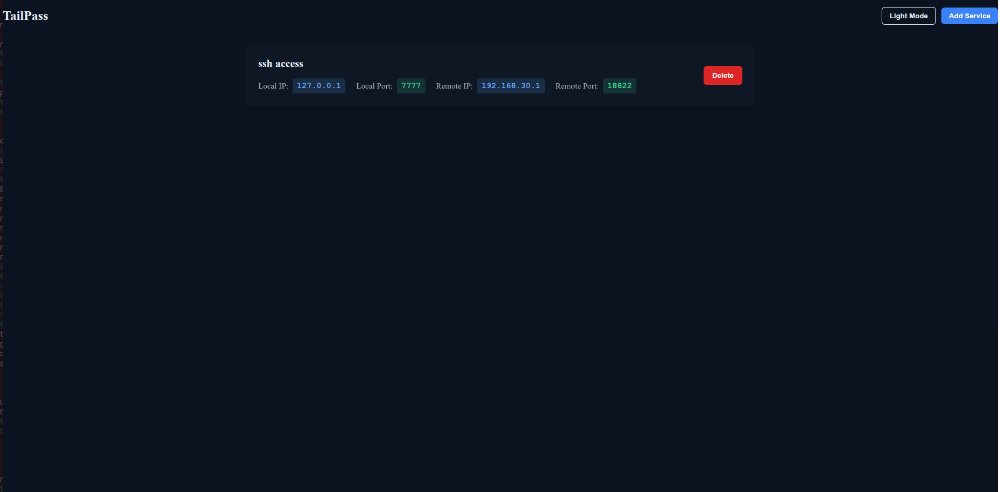
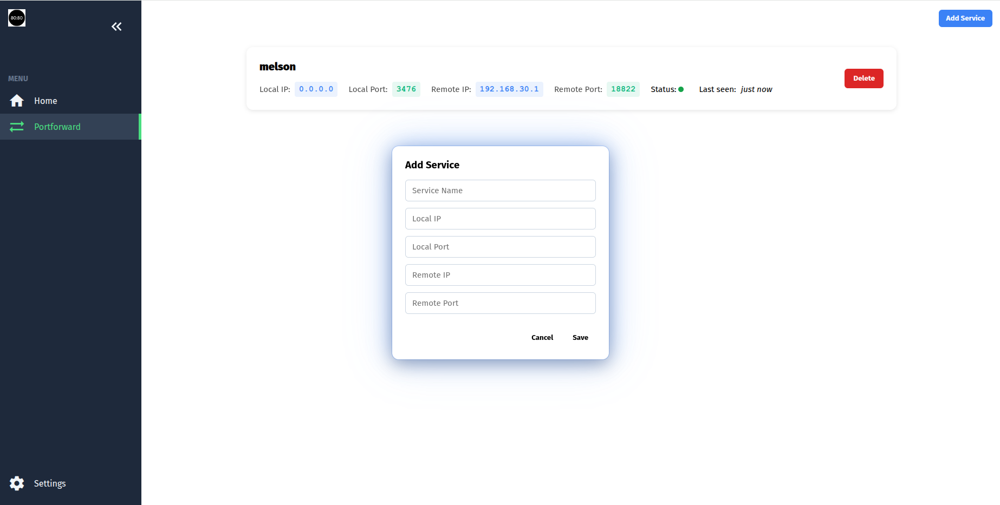
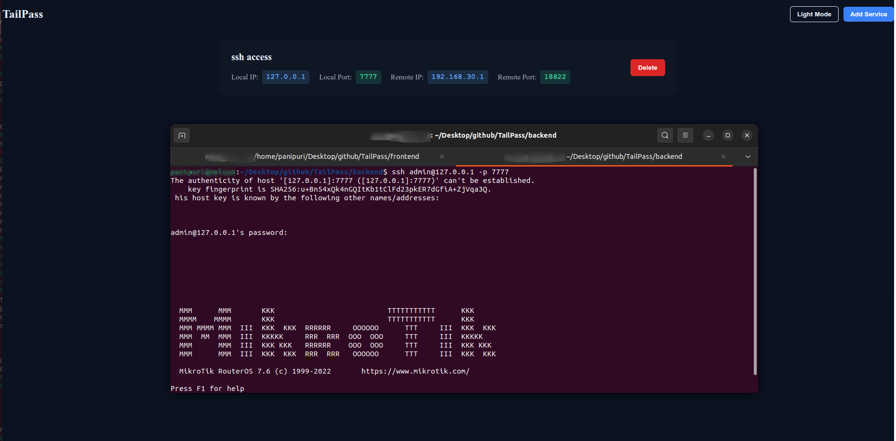
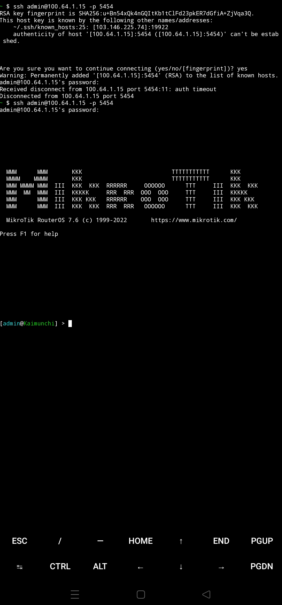

<p align="center">
  
</p>

# TailPass
Tailpass is a Tailscale powered TCP port forwarding tool that bridges your VLANs, containers, and hosts  simply and securely.
You can easily connect web servers, SSH sessions, databases, or any TCP service across your network without worrying about complex configurations.
Add your local and remote services, start the tunnel, and your traffic flows seamlessly through Tailscale. Tailpass gives you a lightweight dashboard, an efficient backend, and the freedom to access your services from anywhere.

## Architecture

<p align="center">
  
</p>

## Screenshots

### Dashboard



### Create




### Service access




### Access TailPass with Phone

<p align="left">
  
</p>

# Running TailPass with Docker Compose
TailPass consists of:
* Backend (Go) – Handles API requests and port forwarding
* Frontend (Vue.js) – Web interface for configuration and monitoring
* PostgreSQL Database – Stores tunnel and service data

All components are containerized and managed with Docker Compose.

# 1. Clone the Repository
```
git clone https://github.com/mascarenhasmelson/TailPass.git
cd TailPass
```
# 2. Build and Run the Containers

```
docker compose up --build
```

# 3. Access the Services

| Service  | URL                  | Description                          |
|-----------|---------------------|--------------------------------------|
| Frontend  | http://localhost:8000 | TailPass Web GUI                     |
| Backend   | http://localhost:8082 | Go API Server                        |
| Database  | localhost:5432        | PostgreSQL (admin / StrongPassword123) |

## Usage

TailPass allows you to forward TCP ports from your local machine, container, or VLAN network through your Tailscale interface — enabling secure remote access to any TCP service such as web servers, SSH, or databases.

You can bind the service to any **local IP address**, including:
- `127.0.0.1` → to expose only on localhost  
- `100.x.x.x` (Tailscale IP) → to expose over your Tailscale network  
- `0.0.0.0` → to listen on all available interfaces  

Added `.env` file for runtime, these are the default parameters
```
POSTGRES_USER=admin
POSTGRES_PASSWORD=StrongPassword123
POSTGRES_DB=tunnel_services
POSTGRES_PORT=5432
VITE_API_URL=http://192.168.20.17:8082
```
## Roadmap

Fix and Features
---

## 🗺️ Roadmap

- [ ] **GUI Improvements**
  - Refine layout and responsiveness  

- [ ] **Health Checks**
  - Implement port-based health monitoring for each service  
  - Periodic background checks with automatic status updates  

- [ ] **Authentication**
  - Add **Login Page** with **JWT-based authentication**  
  - Secure routes for authenticated users only  
  - Token refresh and logout feature  

- [ ] **Input Validation & Sanitization**
  - Validate user inputs before database operations  
  - Show clear error messages for invalid fields  

- [ ] **ORM Integration**
  - Migrate raw SQL queries to ORM-based model handling  
  - Simplify database migrations and schema updates  
  - Improve maintainability and data consistency across services  

- [ ] **Container & Deployment Enhancements**
  - Optimize Docker image size  
  - Add health checks for backend and frontend containers  
  - Support production-ready environment configurations

- [ ] **Service Restart & Stop Controls**  
  Manage running services directly from the GUI (start, stop, restart).  

- [ ] **Container Health Metrics Dashboard**  
  Display container CPU, memory, and uptime statistics in real-time.  

- [ ] **Configurable Alerts**  
  Receive alerts via webhook when a service fails or becomes unreachable.  

---
