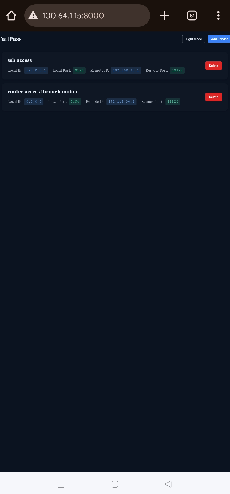
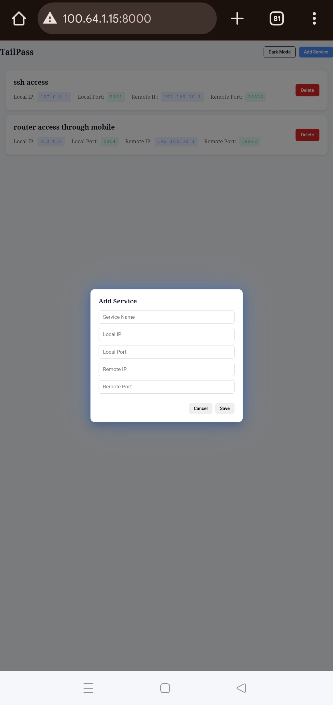

  

# PortPass
Tailpass is a Tailscale powered TCP port forwarding tool that bridges your VLANs, containers, and hosts  simply and securely.
You can easily connect web servers, SSH sessions, databases, or any TCP service across your network without worrying about complex configurations.
Add your local and remote services, start the tunnel, and your traffic flows seamlessly through Tailscale. Tailpass gives you a lightweight dashboard, an efficient backend, and the freedom to access your services from anywhere.

## Architecture

  

## Screenshots

### Dashboard

### Create

### Service access

### Access TailPass with Phone

  

  

  

